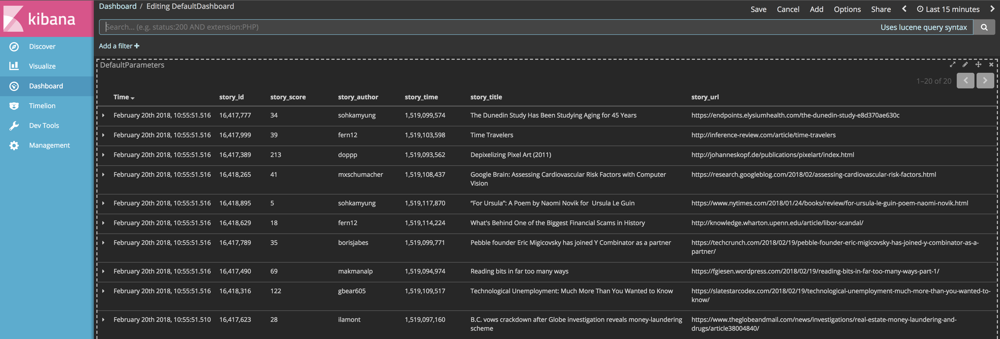

# Hackerbeat

Hackerbeat indexes the top stories of HackerNews into an ElasticSearch instance.

<p align="center"></p>

Ensure that this folder is at the following location:
`${GOPATH}/src/github.com/Ullaakut/hackerbeat`

## Getting Started with Hackerbeat

### Requirements

* [Golang](https://golang.org/dl/) 1.7

### Build

To build the binary for Hackerbeat run the command below. This will generate a binary
in the same directory with the name hackerbeat.

```bash
make
```

### Run

To run Hackerbeat with debugging output enabled, run:

```bash
./hackerbeat -c hackerbeat.yml -e -d "*"
```

### Test

To test Hackerbeat, run the following command:

```bash
make testsuite
```

alternatively:

```bash
make unit-tests
make system-tests
make integration-tests
make coverage-report
```

The test coverage is reported in the folder `./build/coverage/`

### Update

Each beat has a template for the mapping in elasticsearch and a documentation for the fields
which is automatically generated based on `fields.yml` by running the following command.

```bash
make update
```

### Cleanup

To clean up the build directory and generated artifacts, run:

```bash
make clean
```

### Clone

To clone Hackerbeat from the git repository, run the following commands:

```bash
mkdir -p ${GOPATH}/src/github.com/Ullaakut/hackerbeat
git clone https://github.com/Ullaakut/hackerbeat ${GOPATH}/src/github.com/Ullaakut/hackerbeat
```

For further development, check out the [beat developer guide](https://www.elastic.co/guide/en/beats/libbeat/current/new-beat.html).

## Packaging

The beat frameworks provides tools to crosscompile and package your beat for different platforms. This requires [docker](https://www.docker.com/) and vendoring as described above. To build packages of your beat, run the following command:

```bash
make package
```

This will fetch and create all images required for the build process. The hole process to finish can take several minutes.
